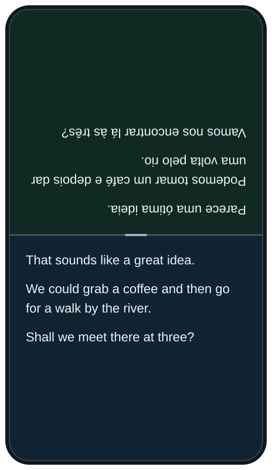

# Face-to-face · Portrait

A quiet, two-sided conversation log. Put the phone between two people, start once, and let each read in their own language.

**Canonical revision:** uniform text, no persistent recording buttons, no language labels in-session, no cursors, and subtly different green/blue sections. Earlier generated pictures are not acceptance criteria.

## Open the clickable prototype

Open [`index.html`](index.html) in a browser after downloading or cloning this repository. It is one self-contained file: no installation, build, API key, backend, external fonts or network requests.

Choose languages on the setup screen and press **Start demo**. Drag the divider; scroll either side; tap a side to open its correctly oriented control panel; hold anywhere on a side to simulate recording. Release finishes the simulated utterance. Stop returns to setup.

This is an interaction prototype, **not a speech or translation implementation**. The multilingual dialogue and recording results are scripted. The demo offers English, Brazilian Portuguese and Norwegian sample text; this is not a promise of engine or offline language support.

## Current mockups

Every image is separate. Every text element has the same 22px size, regular weight and `#edf3f5` color. The vector art has transparent space outside the device.

| State | Image | Reproducible prototype URL suffix |
| --- | --- | --- |
| Live, equal split | [live.svg](mockups/live.svg) | `?snapshot=live` |
| Divider moved, unchanged type | [resized.svg](mockups/resized.svg) | `?snapshot=resized` |
| Controls for the lower participant | [controls.svg](mockups/controls.svg) | `?snapshot=controls` |
| Controls for the upper participant | [controls-top.svg](mockups/controls-top.svg) | `?snapshot=controls-top` |
| Transient recording feedback; no dedicated button | [recording.svg](mockups/recording.svg) | `?snapshot=recording` |



## Read before changing

[`SPEC.md`](SPEC.md) is the design contract. [`DECISIONS.md`](DECISIONS.md) preserves the conversation's refinements and explains why corrections were necessary. The user's later corrections take precedence over contradictory details in earlier images.

[`tests/smoke.py`](tests/smoke.py) exercises the actual HTML in Chromium. [`tests/results.json`](tests/results.json) records the checks run for this revision. These checks do not establish physical-iPhone usability, VoiceOver correctness or real speech performance.

To run the checks or regenerate the five separate SVG/PNG mockups:

```sh
python3 -m pip install playwright pillow
python3 -m playwright install chromium
python3 face2face/portrait/tests/smoke.py
python3 face2face/portrait/tools/render_mockups.py
```

PNG regeneration verifies true RGBA transparency outside the device. No checkerboard is baked into the exported pictures, and no font files are bundled.

## Source archive and delivery boundary

[`archive/README.md`](archive/README.md) and [`archive/manifest.json`](archive/manifest.json) identify the conversation's source images, including rejected iterations and duplicates. Their original PNG bytes and the five new PNG exports are included in the accompanying complete ZIP. The repository contains the canonical SVGs and source; bulk transfer of the historical PNG binaries was not completed through the available connection. Do not treat a manifest entry as proof that its PNG was uploaded to GitHub.

## What is complete, and what remains

The design contract, runnable interaction prototype, reproducible mockups and Chromium checks are complete. This does not modify Trio's production app. To ship this behavior, complete the physical-device touch/accessibility checks in `SPEC.md`, connect the existing session/utterance pipeline, implement durable virtualized history, and verify the full EN ↔ PT-BR phone-on-table experience. Historical PNG transfer is a separate packaging item, not a product implementation.
